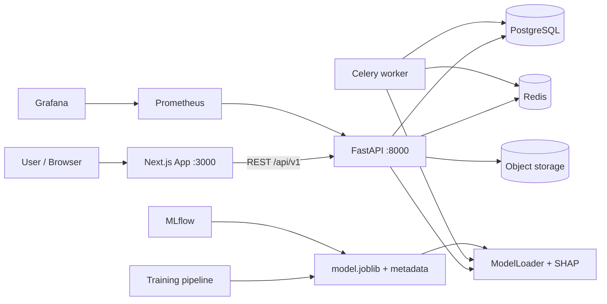

# Architecture

## Overview

The platform follows a classic three-tier monorepo layout: a **FastAPI
backend**, a **Next.js frontend**, and a **Python ML training pipeline** that
produces the served model artifact. Everything is containerised with Docker
Compose and monitored with Prometheus/Grafana.



## Backend

### Layering

The backend enforces strict layering. Dependencies flow one way only:

```
api/ (HTTP layer) → services/ (business logic) → repositories/ (data access) → models/ (ORM)
                               └──→ ml/ (inference), data/ (static catalogs)
```

- **`app/api/v1/endpoints/`** — route definitions, request/response schemas,
  auth + role dependencies, rate-limit decorators. No business logic.
- **`app/services/`** — orchestrate repositories, the model loader, parser and
  catalogs. Unit-testable without HTTP.
- **`app/repositories/`** — thin data-access classes over SQLAlchemy sessions.
- **`app/models/`** — SQLAlchemy 2.0 ORM models with typed `Mapped` columns.

### API surface

All routes live under `/api/v1`. Docs at `/docs`, OpenAPI at
`/api/v1/openapi.json`, metrics at `/metrics`. See [API.md](API.md) for the
full reference.

### Auth

- Access token: short-lived JWT (`HS256`) carrying `sub`, `role`, `jti`.
- Refresh token: stored in the `sessions` table (device-aware), rotated on
  every refresh, revocable via logout.
- Password hashing with `bcrypt` directly (no passlib dependency).
- RBAC via `require_roles(...)` dependency; admin role gates job ingestion.

### Rate limiting & observability

- SlowAPI fixed-window limits per endpoint group (e.g. `100/minute` default,
  `10/minute` for auth).
- Prometheus metrics via `prometheus-fastapi-instrumentator`.
- Structured logging via `structlog` with a request-context middleware
  (request id, user, latency), plus a JSON formatter for production.

## ML pipeline

- **Feature contract** — `ml/career_ml/features.py` is the single source of
  truth for feature names, levels and skill weights. Both the training
  pipeline and the runtime backend import it, which eliminates train/serve
  skew.
- **Data** — `ml/career_ml/generate_data.py` synthesises a deterministic
  10k-row dataset (RNG-seeded) covering titles, locations, industries,
  company sizes, degree levels and skills.
- **Training** — `ml/pipeline/train.py` runs 3-fold cross-validation across
  6 model families (linear, random forest, gradient boosting x3, SVR),
  records metrics (R², RMSE, MAE), optionally tunes hyper-parameters, and
  writes the best artifact plus `metadata.json` and `model_comparison.csv`.
  Results are logged to MLflow when available.
- **Serving** — `backend/app/ml/model_loader.py` resolves the artifact
  relative to the repo root (or an MLflow source), loads it thread-safely, and
  falls back to a deterministic baseline model on cold start so the API never
  5xxs from a missing artifact.
- **Explainability** — `explainer.py` computes SHAP values with a natural
  gradient fallback and a rule-based baseline fallback if SHAP is unavailable.

## Frontend

- Next.js 15 App Router, React 19, TypeScript.
- Auth state via a React context provider backed by `localStorage` JWT tokens
  with automatic refresh-on-401.
- A typed API client (`src/lib/api.ts`) mirrors the backend schema exactly.
- Dashboard shell with sidebar navigation, shadcn/ui components and Recharts
  visualisations (salary trend, SHAP waterfall, grouped bars).

## Data flow examples

**Salary prediction**

1. User submits the profile form → `POST /api/v1/predictions/salary`.
2. Service builds the feature vector (contract from `ml/career_ml/features.py`).
3. ModelLoader returns the trained pipeline; predictor emits salary + bounds.
4. Explainer computes SHAP contributions (gradient/baseline fallback).
5. Response persists a `Predictions` row (feature snapshot) and returns the
   result with the waterfall payload.

**Resume upload**

1. `POST /api/v1/resumes/upload` streams the file to the storage backend.
2. `resume_parser` extracts raw text (PDF/DOCX/TXT).
3. `skill_extractor` matches against the master catalog and persists
   `resume_skills` rows with provenance and confidence.
4. The response returns the parsed structure + detected skills.

## Failure handling

- Every dependency has a fallback: model → baseline, SHAP → gradient →
  rule-based, embeddings → hashed vectors, storage → local directory.
- Structured error responses (`detail`, `code`, `request_id`) from a central
  exception-handler registry.
- Rate-limit and auth errors map to standard `429` / `401` responses.
